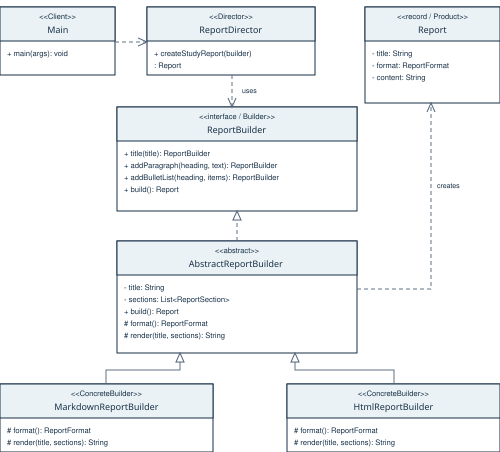

# Assignment 1: Builder Pattern

A small Java 17 example for the first Software Design Patterns assignment.
The program builds a study report in two forms: **plain text** and **HTML**.

## Run

Open the project in IntelliJ IDEA, choose JDK 17, mark `src/main/java` as
Sources Root, and run `kz.aitu.builder.Main`.

Or run these commands from the repository folder (Bash / Git Bash / WSL):

```bash
bash scripts/run.sh
bash scripts/test.sh
```

No external Java libraries are needed. The demo prints both reports and one
custom report to the console. The test class contains five short checks.

## Six classes

| Class | Pattern role | What it does |
| --- | --- | --- |
| `Report` | Product | Stores the finished title and content |
| `ReportBuilder` | Builder | Declares steps, stores data and checks required fields |
| `PlainTextReportBuilder` | ConcreteBuilder | Formats the report as ordinary text |
| `HtmlReportBuilder` | ConcreteBuilder | Formats the report with HTML tags |
| `ReportDirector` | Director | Calls the steps for a sample study report |
| `Main` | Client | Chooses builders and prints results |

`ReportBuilder` is an **abstract class**. It contains common construction code,
so the two concrete builders only need to write their own formatting methods.
The result differs in structure: plain text uses line breaks; HTML uses a
complete document with headings and paragraphs.

```java
ReportDirector director = new ReportDirector();
Report text = director.createStudyReport(new PlainTextReportBuilder());
Report html = director.createStudyReport(new HtmlReportBuilder());
```

The Director is optional. A client can also call the steps directly:

```java
Report report = new PlainTextReportBuilder()
        .setTitle("My homework")
        .addSection("Task", "Practice method chaining")
        .build();
```

`setTitle()` and `addSection()` return `this`, so calls can be chained.
`build()` requires a title and at least one section, then creates a new `Report`.
A fresh builder should be used for each report: `build()` does not clear its data.

## Files

- `src/main/java/kz/aitu/builder/` - the six program classes.
- `src/test/java/kz/aitu/builder/ReportBuilderTest.java` - five simple checks.
- `examples/` - sample plain text and HTML output.
- [UML source](docs/uml.puml) and the diagram below.
- [Report](docs/report.md) / [PDF](output/pdf/assignment-1-report.pdf).
- [Defense notes in Russian](docs/DEFENSE_RU.md).



The assignment asks for instructor confirmation of a free topic. That confirmation
and uploading the report/link to Moodle are separate from this repository.
